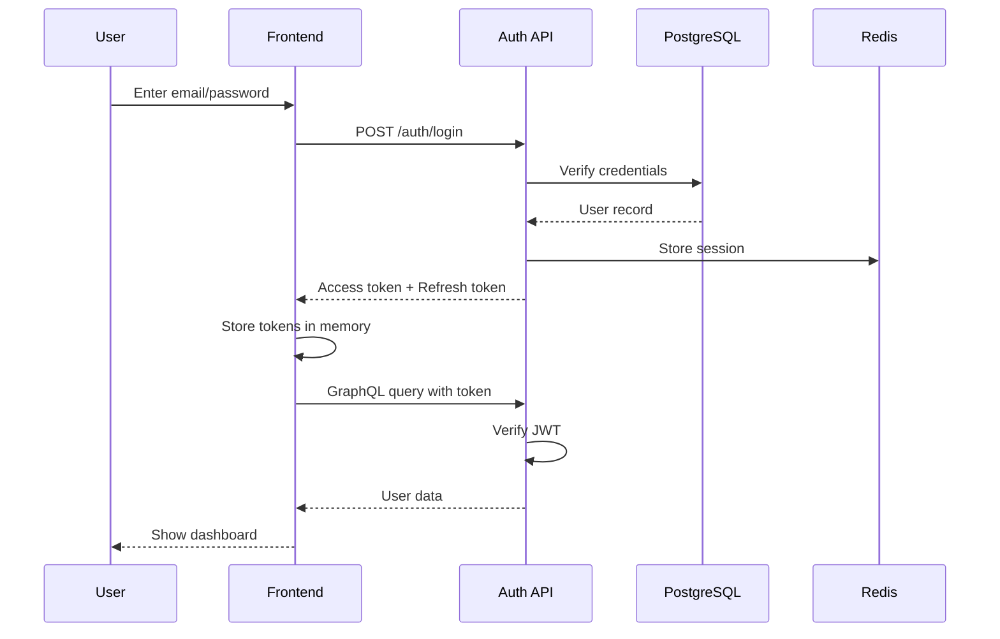
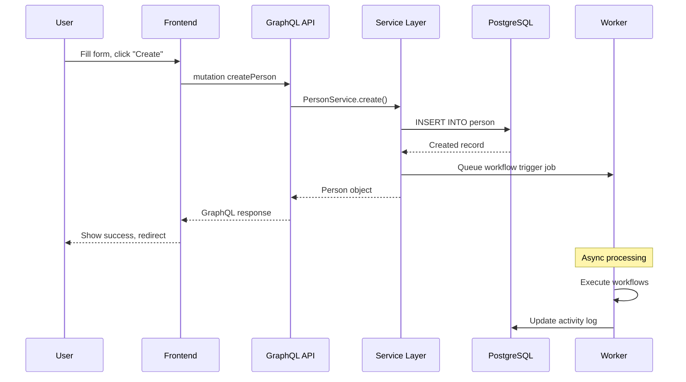
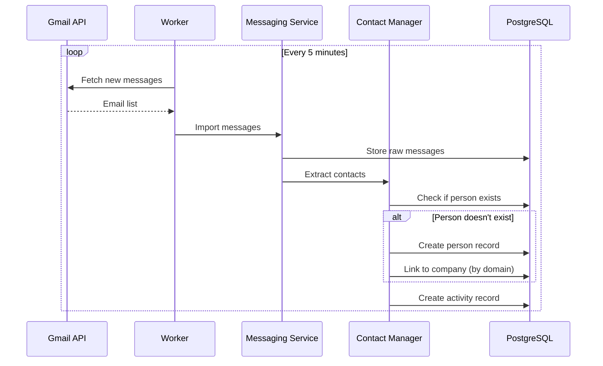
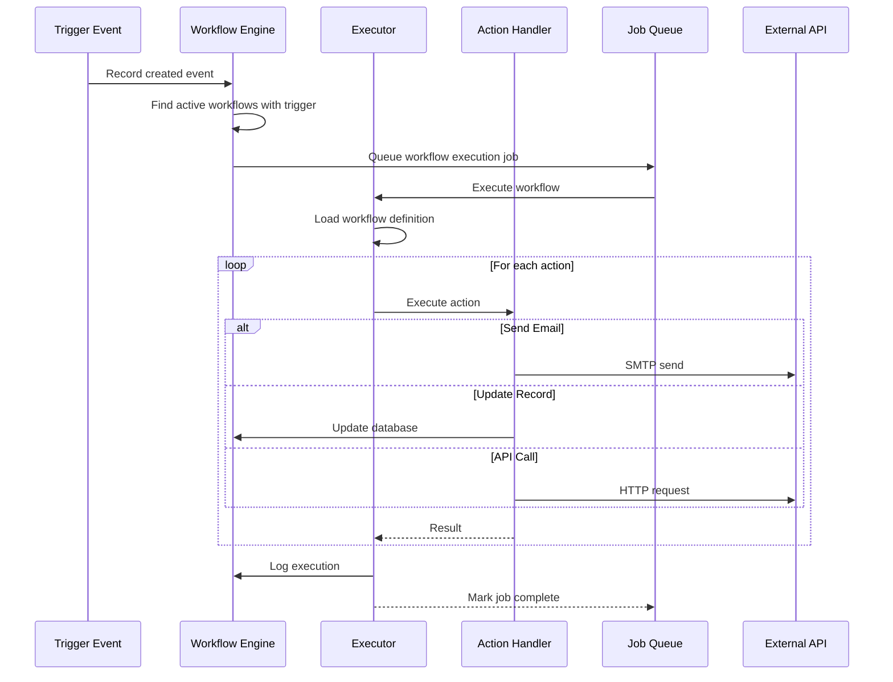

# Architecture Documentation

> **📊 Diagram Rendering Note**
>
> This document contains **Mermaid diagrams** for visualizing data flows and sequences. To view these diagrams properly:
> - **GitHub/GitLab:** Renders automatically in markdown preview
> - **VS Code:** Install the "Markdown Preview Mermaid Support" extension
> - **JetBrains IDEs:** Enable Mermaid plugin in settings
> - **Online:** Use [Mermaid Live Editor](https://mermaid.live) to paste and view
> - **Static Export:** Use `mmdc` CLI tool to generate PNG/SVG images
>
> If diagrams appear as code blocks, your viewer doesn't support Mermaid rendering.

---

## High-Level Architecture

Twenty follows a modern microservices-inspired architecture with clear separation between frontend, backend API, and background job processing. The system is built on a monorepo structure using Nx for orchestration.

### System Components

```
┌─────────────────────────────────────────────────────────────┐
│                     External Services                       │
│  Gmail, Outlook, S3, Stripe, OAuth Providers, Webhooks     │
└─────────────────────────────────────────────────────────────┘
                              ▲
                              │
┌─────────────────────────────┼───────────────────────────────┐
│                             │                               │
│  ┌──────────────────────────▼─────────────────────────┐   │
│  │           Browser Extension (Chrome)               │   │
│  └────────────────────────────────────────────────────┘   │
│                                                             │
│  ┌──────────────────────────────────────────────────┐     │
│  │      Frontend (React + TypeScript + Vite)       │     │
│  │                                                  │     │
│  │  • React 18 with Recoil state management       │     │
│  │  • Apollo Client for GraphQL                   │     │
│  │  • Emotion for styling                         │     │
│  │  • Vite for bundling                           │     │
│  │                                                  │     │
│  │  Port: 3001                                     │     │
│  └──────────────────┬───────────────────────────────┘     │
│                     │ GraphQL/REST                         │
│  ┌──────────────────▼───────────────────────────────┐     │
│  │      Backend API (NestJS + GraphQL Yoga)        │     │
│  │                                                  │     │
│  │  • GraphQL API (main interface)                │     │
│  │  • REST API (documentation, webhooks)          │     │
│  │  • Authentication & Authorization              │     │
│  │  • Business logic modules                      │     │
│  │  • TypeORM for database ORM                    │     │
│  │                                                  │     │
│  │  Port: 3000                                     │     │
│  └──────┬─────────────────────┬─────────────────────┘     │
│         │                     │                           │
│  ┌──────▼─────────┐    ┌──────▼───────────────────────┐  │
│  │  Job Queue     │    │   Background Worker          │  │
│  │  (BullMQ)      │    │   (NestJS Process)           │  │
│  │                │◄───┤                              │  │
│  │  • Redis-backed│    │  • Email sync                │  │
│  │  • Job storage │    │  • Calendar sync             │  │
│  │  • Scheduling  │    │  • Workflow execution        │  │
│  └────────────────┘    │  • Message import            │  │
│                        │  • Background tasks          │  │
│                        └──────────────────────────────┘  │
│                                                            │
└────────────────────────────────────────────────────────────┘
                              │
        ┌─────────────────────┼─────────────────────┐
        │                     │                     │
┌───────▼────────┐   ┌────────▼────────┐   ┌──────▼─────────┐
│  PostgreSQL    │   │     Redis       │   │  File Storage  │
│                │   │                 │   │                │
│  • Core data   │   │  • Sessions     │   │  • S3 / Local  │
│  • Metadata    │   │  • Cache        │   │  • Attachments │
│  • TypeORM     │   │  • Job queue    │   │  • Images      │
└────────────────┘   └─────────────────┘   └────────────────┘
```

## Component Breakdown

### 1. Frontend (twenty-front)

**Technology:** React 18 + TypeScript + Vite

**Key Responsibilities:**
- User interface rendering
- State management with Recoil
- GraphQL data fetching with Apollo Client
- Client-side routing with React Router
- Form validation and submission
- Real-time updates via GraphQL subscriptions

**Module Structure:**
```
twenty-front/src/
├── modules/           # Feature modules
│   ├── auth/         # Authentication UI
│   ├── object-record/ # Record display and editing
│   ├── views/        # View configuration
│   ├── workflow/     # Workflow builder UI
│   ├── settings/     # Settings interface
│   └── ...
├── pages/            # Route pages
├── state/            # Recoil atoms and selectors
├── generated/        # Auto-generated GraphQL types
└── __generated__/    # GraphQL operations
```

**Communication Pattern:**
- **GraphQL Queries:** Fetch data from backend
- **GraphQL Mutations:** Create/update/delete records
- **GraphQL Subscriptions:** Real-time updates (via WebSocket)
- **REST API:** File uploads, specific endpoints

### 2. Backend API Server (twenty-server)

**Technology:** NestJS + GraphQL Yoga + TypeORM

**Key Responsibilities:**
- GraphQL API endpoint (primary interface)
- REST API endpoints (webhooks, docs, uploads)
- Authentication and authorization
- Business logic execution
- Database operations via TypeORM
- Job queue management
- External API integrations

**Module Structure:**
```
twenty-server/src/
├── engine/           # Core engine modules
│   ├── core-modules/ # Workspace, auth, user, file-storage
│   ├── metadata-modules/ # Object metadata, field metadata
│   └── twenty-orm/   # Custom ORM layer
├── modules/          # Business modules
│   ├── calendar/     # Calendar integration
│   ├── messaging/    # Email/message handling
│   ├── workflow/     # Workflow engine
│   ├── company/      # Company records
│   ├── person/       # Person records
│   ├── opportunity/  # Sales opportunities
│   └── ...
├── database/         # TypeORM configuration
│   ├── typeorm/      # Migrations and datasources
│   └── clickhouse/   # ClickHouse analytics (optional)
└── queue-worker/     # Worker process entry point
```

**API Layers:**
1. **GraphQL Layer:** Main API interface
2. **Service Layer:** Business logic
3. **Repository Layer:** Data access
4. **Database Layer:** PostgreSQL via TypeORM

### 3. Background Worker

**Technology:** NestJS + BullMQ

**Key Responsibilities:**
- Process jobs from Redis queue
- Email synchronization from Gmail/Outlook
- Calendar event synchronization
- Workflow execution
- Message import and parsing
- Scheduled tasks
- Long-running operations

**Job Types:**
- `messaging:message-import` - Import emails from connected accounts
- `calendar:event-sync` - Sync calendar events
- `workflow:execute` - Run workflow automations
- `contact-creation-manager` - Auto-create contacts from emails
- `billing:subscription-check` - Check Stripe subscriptions

### 4. Data Layer

#### PostgreSQL Database

**Purpose:** Primary data storage

**Schema Organization:**
- **core schema:** Core tables (workspace, user, workspace_member, etc.)
- **metadata schema:** Object and field metadata definitions
- **Data tables:** One table per custom/standard object

**Key Tables:**
- `workspace` - Multi-tenant workspace isolation
- `user` - User accounts
- `workspaceMember` - User-workspace associations
- `object` - Object metadata definitions
- `fieldMetadata` - Field definitions
- `person`, `company`, `opportunity` - Standard CRM entities
- Dynamic tables for custom objects

#### Redis

**Purpose:** Caching, sessions, job queue

**Usage:**
- **Session Store:** Express session persistence
- **Job Queue:** BullMQ job storage
- **Cache:** Metadata cache, query results
- **Rate Limiting:** API rate limit counters
- **Pub/Sub:** GraphQL subscription events

#### File Storage

**Purpose:** Attachment and image storage

**Backends:**
- **Local:** Development mode (`.local-storage/`)
- **AWS S3:** Production file storage
- **S3-Compatible:** MinIO, DigitalOcean Spaces, etc.

**Stored Items:**
- User avatars
- Company logos
- Attachment files
- Workflow diagrams
- Export files

## Data Flow

### 1. User Authentication Flow



### 2. Record Creation Flow



### 3. Email Sync Flow



### 4. Workflow Execution Flow



## Authentication & Authorization

### Authentication Methods

1. **Email/Password:**
   - Password hashed with bcrypt
   - JWT tokens (access + refresh)
   - Session stored in Redis

2. **Google OAuth:**
   - OAuth 2.0 flow
   - Google API for user info
   - Auto-create user on first login

3. **Microsoft OAuth:**
   - Azure AD integration
   - Microsoft Graph API
   - Enterprise SSO support

4. **SAML SSO:**
   - Enterprise SSO via SAML 2.0
   - IdP-initiated and SP-initiated flows
   - Support for Okta, OneLogin, etc.

5. **API Keys:**
   - Workspace-scoped API keys
   - Used for programmatic access
   - Separate from user tokens

### Authorization Model

**Role-Based Access Control (RBAC):**

```
Workspace
  ├── Roles (Admin, Editor, Viewer, Custom)
  │     ├── Object Permissions (Read, Write, Delete)
  │     └── Field Permissions (Read, Write)
  └── Members
        └── Assigned Role
```

**Permission Levels:**
- **Workspace Admin:** Full access to all features
- **Workspace Member:** Standard access based on role
- **Role Permissions:** Granular object and field-level access
- **Record Ownership:** Additional permissions for owned records

**Permission Evaluation:**
```typescript
canAccess(user, record, action) {
  1. Check workspace membership
  2. Get user's role
  3. Check role permissions for object
  4. Check field-level permissions
  5. Check record ownership rules
  6. Return allow/deny
}
```

## API Communication

### GraphQL API (Primary)

**Endpoint:** `http://localhost:3000/graphql`

**Features:**
- Single endpoint for all operations
- Type-safe schema
- Introspection for documentation
- Real-time subscriptions via WebSocket
- Batched queries for performance
- Rate limiting per workspace

**Schema Structure:**
- **Queries:** Fetch data (read operations)
- **Mutations:** Modify data (write operations)
- **Subscriptions:** Real-time updates
- **Types:** Generated from metadata

**Example Query:**
```graphql
query GetPeople {
  people(first: 10) {
    edges {
      node {
        id
        name {
          firstName
          lastName
        }
        email
        company {
          id
          name
        }
      }
    }
  }
}
```

### REST API (Secondary)

**Base URL:** `http://localhost:3000/rest`

**Endpoints:**
- `/rest/api/docs` - OpenAPI documentation
- `/rest/webhooks/:id` - Webhook receivers
- `/rest/auth/*` - OAuth callbacks
- `/rest/files/*` - File uploads/downloads

### WebSocket (Subscriptions)

**Protocol:** GraphQL over WebSocket

**Use Cases:**
- Real-time record updates
- Workflow status updates
- Notification delivery
- Collaborative editing indicators

## Scalability Considerations

### Horizontal Scaling

**Frontend:**
- Stateless React app
- Can be deployed on CDN
- Multiple instances behind load balancer

**Backend API:**
- Stateless NestJS app
- Scales horizontally with load balancer
- Session stored in Redis (shared state)

**Worker:**
- Multiple worker instances
- Job distribution via BullMQ
- Each worker processes jobs from shared queue

### Database Scaling

**Read Replicas:**
- PostgreSQL read replicas for queries
- Write to primary, read from replicas
- TypeORM connection pooling

**Connection Pooling:**
- PgBouncer for connection management
- Reduces connection overhead
- Supports high concurrency

**Partitioning:**
- Table partitioning by workspace_id
- Improves query performance for multi-tenant

### Caching Strategy

**Levels:**
1. **Browser Cache:** Static assets, API responses
2. **Redis Cache:** Metadata, frequent queries
3. **Database Cache:** PostgreSQL query cache

**Cache Invalidation:**
- Metadata changes trigger cache clear
- Record updates invalidate related caches
- TTL-based expiration for stale data

## Security Architecture

### Data Encryption

**At Rest:**
- PostgreSQL encryption (filesystem level)
- S3 bucket encryption
- Encrypted backups

**In Transit:**
- HTTPS/TLS for all API calls
- WSS for WebSocket connections
- Encrypted database connections

### Request Security

**Rate Limiting:**
- Per-workspace limits on GraphQL API
- IP-based rate limiting
- Configurable thresholds

**CORS Protection:**
- Whitelist allowed origins
- Credentials included in requests
- Preflight request handling

**CSRF Protection:**
- Token-based CSRF for mutations
- SameSite cookie attributes
- Double-submit cookie pattern

### Input Validation

**Layers:**
1. **Frontend:** React Hook Form + Zod schemas
2. **API:** NestJS validation pipes
3. **Service:** Business logic validation
4. **Database:** Constraints and triggers

### Audit Logging

**Tracked Events:**
- User authentication attempts
- Record modifications (create, update, delete)
- Permission changes
- Workflow executions
- API key usage

**Log Storage:**
- Stored in PostgreSQL audit tables
- Retention policies configurable
- Export capabilities for compliance

## Monitoring & Observability

### Metrics Collection

**OpenTelemetry Integration:**
- Distributed tracing
- Metrics export
- Custom spans for key operations

**Prometheus Metrics:**
- API request latency
- Job queue depth
- Database query performance
- Error rates

### Logging

**Structured Logging:**
- JSON format
- Contextual information (workspace, user)
- Log levels (error, warn, info, debug)

**Log Aggregation:**
- Supports centralized logging (ELK, Datadog, etc.)
- Correlation IDs for request tracing

### Error Tracking

**Sentry Integration:**
- Frontend error capture
- Backend exception tracking
- Performance monitoring
- Release tracking

## Deployment Architecture

### Docker Compose (Development)

```yaml
services:
  - postgres: Database server
  - redis: Cache and queue
  - server: Backend API + Worker
  - frontend: React app (Vite dev server)
```

### Kubernetes (Production)

```
┌─────────────────────────────────────────┐
│              Ingress Controller          │
│         (nginx, Traefik, etc.)          │
└──────────┬─────────────────┬────────────┘
           │                 │
    ┌──────▼──────┐   ┌──────▼──────────┐
    │  Frontend   │   │   Backend API   │
    │  Deployment │   │   Deployment    │
    │  (3 pods)   │   │   (5 pods)      │
    └─────────────┘   └─────┬───────────┘
                            │
                      ┌─────▼──────────┐
                      │     Worker     │
                      │   Deployment   │
                      │   (3 pods)     │
                      └────────────────┘
                            │
       ┌────────────────────┼────────────────┐
       │                    │                │
┌──────▼─────────┐   ┌──────▼──────┐  ┌─────▼────────┐
│  PostgreSQL    │   │    Redis     │  │  S3 Bucket   │
│  StatefulSet   │   │  StatefulSet │  │  (External)  │
│  (with PVC)    │   │  (with PVC)  │  └──────────────┘
└────────────────┘   └──────────────┘
```

**Scaling Configuration:**
- HPA (Horizontal Pod Autoscaler) for API and Worker
- Resource requests and limits defined
- Liveness and readiness probes
- Rolling update strategy

## Technology Decisions & Rationale

| Choice | Rationale |
|--------|-----------|
| **Nx Monorepo** | Code sharing, unified tooling, atomic commits across packages |
| **TypeScript** | Type safety, better DX, catches errors at compile time |
| **NestJS** | Enterprise-ready Node.js framework, modular architecture, DI |
| **GraphQL** | Flexible queries, type-safe API, efficient data fetching |
| **Recoil** | Simple state management, minimal boilerplate, great DX |
| **TypeORM** | Mature ORM, migration support, TypeScript-first |
| **PostgreSQL** | Robust RDBMS, JSON support, rich extension ecosystem |
| **Redis** | Fast in-memory store for caching and queues |
| **BullMQ** | Reliable job queue, Redis-backed, retry logic |
| **Vite** | Fast dev server, optimized builds, ESM-native |

## Future Architecture Enhancements

**Planned Improvements:**
- [ ] GraphQL Federation for modular schema
- [ ] Event-driven architecture with message bus
- [ ] Read-write splitting for database queries
- [ ] Serverless functions for custom logic
- [ ] ClickHouse integration for analytics workloads
- [ ] Multi-region deployment support
- [ ] Edge caching with CDN integration
- [ ] gRPC for internal service communication

---

**See Also:**
- [Code Structure](./04_Code_Structure.md) for detailed module organization
- [API Documentation](./05_API_Documentation.md) for endpoint reference
- [Setup Guide](./02_Setup_and_Runbook.md) for deployment instructions
